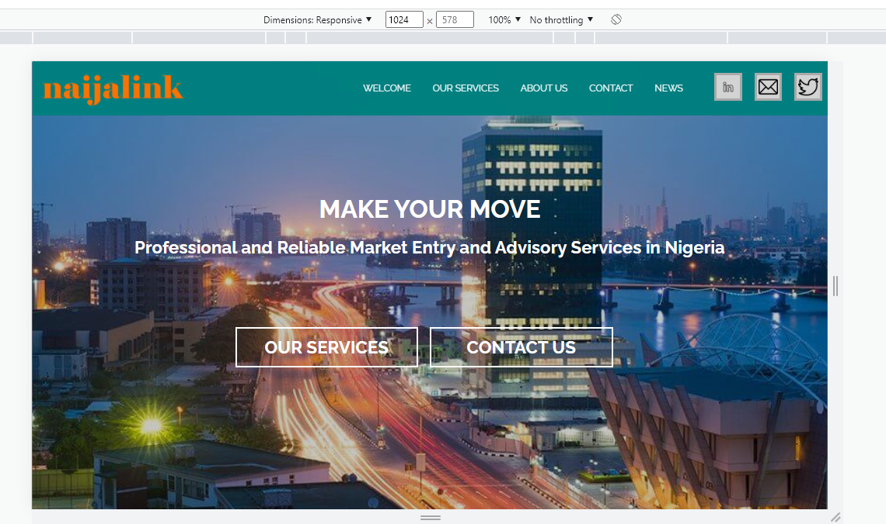

# Getting Started with my First React Multi-page Website

This project was created using React, it is a simple multi-page website which gives basic information about a company and the services they offer. I used React to build the website, because of it's quick, fast and efficient way of changing between pages.

## Table of contents

- [Overview](#overview)
  - [Screenshot](#screenshot)
  - [Links](#links)
- [My process](#my-process)
  - [Built with](#built-with)
  - [What I learned](#what-i-learned)
  - [Continued development](#continued-development)
  - [Useful resources](#useful-resources)
- [Author](#author)

## Overview
Created a multi-page website that is responsive using React.js and SCSS

### Screenshot

### Links

- Solution URL: [https://github.com/Mbrimes/Naijalink-Clone.git](https://github.com/Mbrimes/Naijalink-Clone.git)
- Live Site URL: [https://naijalink-clone.netlify.app/](https://naijalink-clone.netlify.app/)

### My process

-Installed React, React Router and a few dependencies needed for my project
-Used SCSS as my css pre-processor for writing my css file
-On completion i did a quick overview of my code and the website on my localhost, before pushing it to my git repository and deploying it on Netlify.

### Built with

- Semantic HTML5 markup
- SCSS
- CSS custom properties
- CSS Grid
- React.Js
- React Router

### What I learned

- I learnt how to use React.Js and React Router in routing between pages 

### Continued development

- I would continue focusing and building my React knowledge and skills, so has to be able to build more complex react based applications.
- I would also learn Next.js and Tailwind CSS, so has to be able to build more proficient and effective react based applications.

### Useful resources

- [Resource 1](https://www.W3school.com) - This helped me in understanding basic concepts of React.js. I really liked the pattern of learning and will use it going forward.
- [Resource 2](https://www.freecodecamp.org) - This is an amazing website which helped me finally understand how to properly build and predeploy my React website. I'd recommend it to anyone still learning this concept.

## Author

-  Djakpo Abraham

 